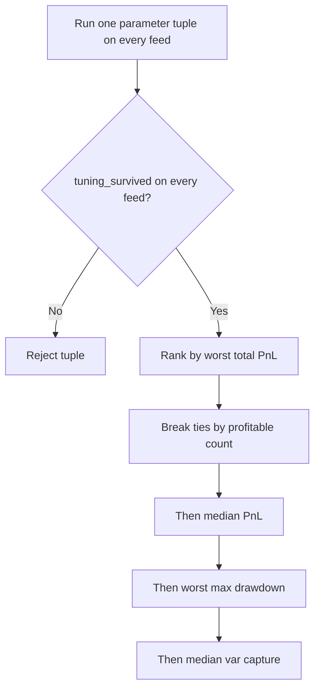

# Methodology

## 1. Surface Model

### 1.1 SABR specification (Hagan 2002 lognormal approximation)

For each expiry slice $T$, the code uses fixed $\beta = 0.5$ and calibrates
$(\alpha, \rho, \nu)$ in the lognormal SABR model:

$$
dF_t = \alpha_t F_t^{\beta} dW_t^{(1)}
$$

$$
d\alpha_t = \nu \alpha_t dW_t^{(2)}
$$

$$
corr(dW_t^{(1)}, dW_t^{(2)}) = \rho
$$

For strike $K$, forward $F$, expiry $T$, define
$z = \frac{\nu}{\alpha}(FK)^{(1-\beta)/2}\log(F/K)$ and

$$
\chi(z) = \log((\sqrt{1-2\rho z + z^2}+z-\rho)/(1-\rho))
$$

The implemented implied-vol approximation is

$$
\sigma_{SABR}(K,T) =
\frac{\alpha}{(FK)^{(1-\beta)/2}(1 + \frac{(1-\beta)^2}{24}\log^2(F/K) + \frac{(1-\beta)^4}{1920}\log^4(F/K))}
\cdot \frac{z}{\chi(z)}
\cdot (1 + A(T))
$$

with

$$
A(T) = (\frac{(1-\beta)^2}{24}\frac{\alpha^2}{(FK)^{1-\beta}}
+ \frac{1}{4}\frac{\rho\beta\nu\alpha}{(FK)^{(1-\beta)/2}}
+ \frac{2-3\rho^2}{24}\nu^2)T
$$

ATM handling uses the standard $\log(F/K) \to 0$ limit in code.

### 1.2 Calibration objective

Per expiry slice, calibration minimizes

$$
\min_{\alpha,\rho,\nu} \sum_i (\sigma_{SABR}(K_i,T_j)-\sigma^{mkt}_{i,j})^2
$$

implemented as an L-BFGS-B constrained least-squares objective over valid bounds.

### 1.3 Arbitrage checks and enforcement

The code exposes explicit calendar and butterfly checks:

- Calendar: total variance monotonicity at fixed strike,
  $w(K,T_2) \ge w(K,T_1)$ for $T_2 > T_1$.
- Butterfly: nonnegative call convexity in strike (Breeden-Litzenberger positivity proxy),
  $\partial^2 C / \partial K^2 \ge 0$ numerically.

For spline backend, repairs are applied explicitly (calendar projection and local butterfly repair).
For SABR backend, arbitrage is checked and reported, but not globally projected by construction.

### 1.4 Known failure modes (important)

SABR approximation quality degrades for very short expiry and large moneyness,
especially when $|\log(F/K)|$ is large and $T$ is small. In those regions:

- Hagan asymptotics can become unstable or biased.
- Calibration objective can become shallow/non-identifiable.
- Numerical arbitrage checks may fail despite smooth fitted slices.

This is a model limitation, not a software bug.

## 2. Quoting Rule

### 2.1 Base half-spread (implementation form)

In vol space, the half-spread is

$$
hs_t = \max\{h_{min}, h_{base}, h_{risk}\} + h_{inv}
$$

with

$$
h_{base} = h_0 + a_v|\nu_{opt}| + a_\Gamma |\Gamma_{opt}|S + \frac{a_{dte}}{\sqrt{DTE}} + a_{oi} h_{min} \frac{OI_{ref}}{\max(OI,1)}
$$

$$
h_{risk} = k_v|\nu_{opt}| + k_\Gamma |\Gamma_{opt}|S
$$

$$
h_{inv} = \eta |\nu_{book}| / \nu_{limit}
$$

Bid/ask vols are built around shifted mid vol and then mapped to prices.

### 2.2 Gamma-target feedback

For short-dated, near-ATM quotes, the gamma feedback term is

$$
pull_t^{bps} = g_s(\Gamma^* - \Gamma_t^{book})
$$

optionally multiplied by a cheap-vol boost factor $m_t \in \{1, 1.2\}$.

In difference-equation form:

$$
\Delta bid_t^{vol} = 10^{-4} m_t g_s(\Gamma^* - \Gamma_t^{book})
$$

If book gamma is below target, bids are raised (more aggressive gamma acquisition);
if above target, pull turns negative.

### 2.3 Inventory penalty (quadratic)

Book penalty is quadratic in normalized risk state
$x = [\Delta/\Delta_{max}, \Gamma/\Gamma_{max}]^T$:

$$
\phi(x) = \lambda_\Delta (\Delta/\Delta_{max})^2 + \lambda_\Gamma (\Gamma/\Gamma_{max})^2
$$

Directional signs then map this to mid-vol shift against inventory accumulation.

### 2.4 Kelly-style strike cap

Per-contract cap is

$$
q_{max}(K,T) = \min(q_{hard}, f\frac{B}{|\Gamma_{opt}|S^2})
$$

with bankroll $B$, quarter-Kelly $f = 0.25$, and hard cap $q_{hard}$.

Derivation sketch: if local edge scales with curvature exposure and drawdown risk scales with
$|\Gamma|S^2$, a Kelly fraction on curvature-risk budget implies inverse-gamma sizing.
Quarter-Kelly is used to reduce estimation-error fragility.

## 3. Hedge Policy

### 3.1 Continuous delta hedge

Rebalance when

$$
|\Delta_{portfolio}| > \varepsilon
$$

where $\varepsilon$ is the rebalance threshold.

### 3.2 Discrete hedge

At fixed interval $\Delta t_h$, with unhedged gamma error approximation,

$$
Var(\epsilon) \approx \frac{1}{3}\Gamma^2\sigma^4 S^4 \Delta t_h^2
$$

This is the standard second-order discretization scaling used to reason about hedge-frequency trade-offs.

### 3.3 Break-even move

Using theta cost and gamma carry over one step, break-even fractional move is

$$
\frac{\Delta S^*}{S} = \frac{\sqrt{2|\Theta|/|\Gamma|}}{S}
$$

implemented as the per-step break-even move metric.

## 4. Stress Design

### 4.1 Scenario grid

The engine runs structured shocks including spot jumps, vol shifts, skew twists,
term-slope changes, vol-of-vol wing changes, rho shifts, and a combined spot-vol grid.
Ranges are intentionally wide to probe convexity and gap-risk asymmetry, not to represent
single-day realistic frequencies.

### 4.2 Why adversarial Bates and rough-vol regimes matter

Adversarial regimes (Bates, rough volatility) are harder because they jointly induce:

- jump and leverage asymmetry,
- clustered volatility with rapid local roughness,
- calibration stress for smooth low-dimensional surfaces (including SABR).

A strategy that only survives diffusion-like synthetic feeds is not robust.

### 4.3 Tail hedge trigger economics

Tail hedge trigger: add 1M ~10-delta puts when net delta exceeds trigger ratio.
Expected trade-off:

- Cost: persistent premium bleed in benign regimes.
- Protection: nonlinear downside convexity under large negative spot shocks.

The relevant monitoring ratio is

$$
R_{protect} = \frac{|\Delta loss|}{premium\ outlay}
$$

## 5. P&L Attribution Identity

Full second-order decomposition:

$$
dV = \Delta dS + \frac{1}{2}\Gamma(dS)^2 + \Theta dt + \nu d\sigma + vanna\, dS\, d\sigma + \frac{1}{2}volga\, (d\sigma)^2 + \epsilon
$$

In the current runtime attribution, tracked terms are
$\Delta dS$, $\frac{1}{2}\Gamma dS^2$, $\Theta dt$, and $\nu d\sigma$;
residual $\epsilon$ is measured as the unexplained remainder:

$$
\epsilon = dV - (\Delta dS + \frac{1}{2}\Gamma dS^2 + \Theta dt + \nu d\sigma)
$$

Variance-capture identity (long-gamma intuition):

$$
\mathbb{E}[\Gamma(dS)^2 + \Theta dt] = \frac{1}{2}\Gamma S^2(\sigma^2_{realized} - \sigma^2_{implied})dt
$$

under local approximations and stable gamma over the interval.

## 6. Sweep Selection Objective

The compact sweep in `src/vol_surface_mm/scripts/param_sweep.py` evaluates parameter tuples

- `kelly_fraction`
- `gamma_target`
- `tail_hedge_trigger`
- `stress_guard_multiple`

across the feed set `{gbm, bates, rough, real_aapl}`.

Each raw run records `total_pnl`, `var_capture`, `max_drawdown`,
`tuning_survived`, `survived`, and `profitable`. The canonical selector then
groups rows by parameter tuple, requires `tuning_survived=True` on every feed,
and ranks grouped tuples by the following lexicographic order:

1. maximize worst `total_pnl`
2. maximize `profitable_count`
3. maximize median `total_pnl`
4. minimize worst `max_drawdown`
5. maximize median `var_capture`

This is a deployability-first rule rather than a best-looking-single-row rule:
a tuple that wins on one feed but fails badly on another should lose to a more
stable cross-feed bundle. The legacy single-row `var_capture` winner is still
written to the text summary for auditability, but it is no longer the primary
selection criterion.

## 7. Limitations

- Default artifact generation is synthetic. The sweep harness now includes an optional `real_aapl` history feed backed by a public GitHub AAPL OHLC CSV, but option chains, fills, and surface fitting remain synthetic on top of that path.
- SABR is structurally mis-specified in rough-vol regimes; smooth-parametric fit can hide local pathologies.
- Fill model is synthetic and not calibrated to real order flow or toxicity metrics.
- Transaction costs are parametric; there is no empirical cost curve calibration.

A skeptical reviewer should treat all strategy conclusions as conditional on these assumptions.
