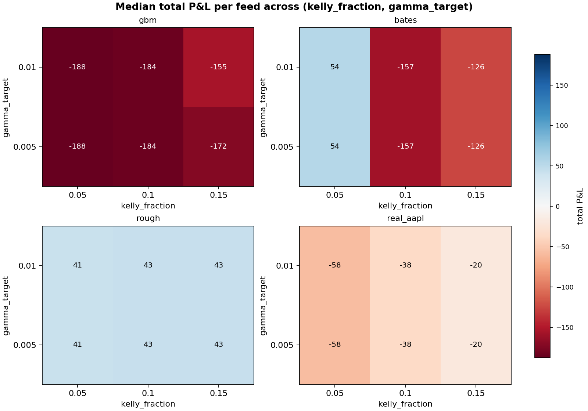
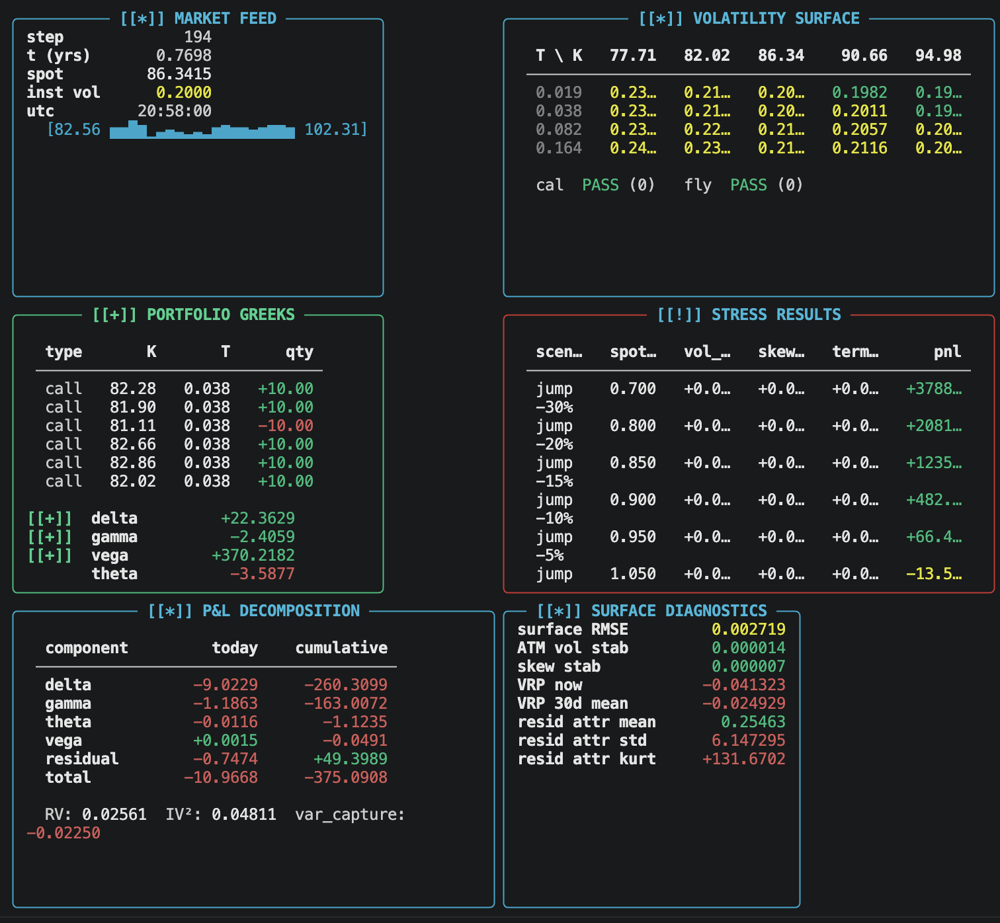
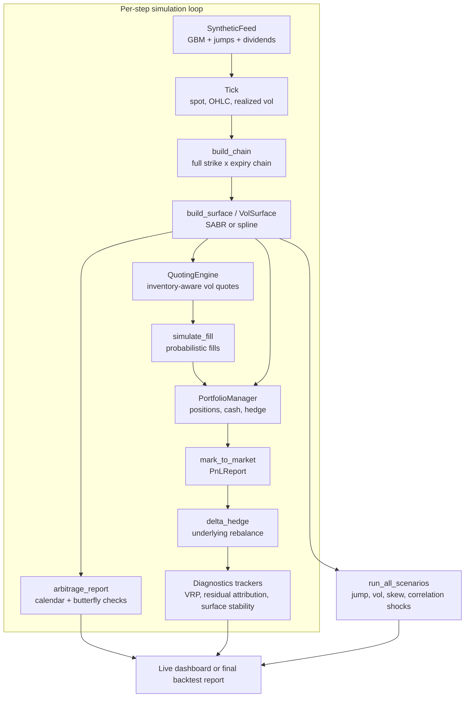

# vol-surface-mm

Options market-making simulator. A synthetic GBM + Merton-jump underlying
drives a continuously-refitted implied volatility surface (SABR or
cubic-spline). A quoting engine posts two-sided markets on a full
strike-expiry chain; a delta hedger replicates the resulting book. Output:
per-step P&L decomposed into delta, gamma, theta, vega, and residual;
realized-vs-implied variance capture; residual-attribution distribution; scenario
Greeks under spot jumps, parallel vol shifts, skew twists, and correlation
shocks. The system is self-contained and calibration-free — useful for
testing surface models, quoting heuristics, and hedging strategies before
touching production data. The sweep harness now also ships an optional
real-history research feed, `real_aapl`, backed by Plotly's public AAPL
OHLC sample on GitHub.

## Portfolio Highlights



### Live dashboard

<p align="center">
  
</p>

- **End-to-end simulator, not a strategy claim.** Synthetic feed, SABR
  surface, two-sided quoting, delta hedging, scenario stress, and a Rich
  live dashboard, all in one deterministic loop.
- **Grouped cross-feed sweep.** [src/vol_surface_mm/scripts/param_sweep.py](src/vol_surface_mm/scripts/param_sweep.py) ranks `(kelly,
  gamma_target, tail, stress_guard)` tuples by how many of four feeds
  (`gbm`, `bates`, `rough`, `real_aapl`) survive a live-path rule, then
  by worst-feed P&L. See [results/README.md](results/README.md).
- **Honest finding.** No tuple was profitable on every feed in the
  cross-feed sweep. After switching to a flat default seed and adding a
  gamma-protection wing-buying rule, the headline backtest now survives
  on 2/3 feeds (`bates` +53.73, `rough` +41.45, `gbm` -187.89) and worst-case
  stress P&L improves from -3,693 to -3,208.65. The repo is published as
  research scaffolding, not a deployable edge.
- **Stress-aware quoting.** A cached worst-shock revaluation rejects
  fills that would deepen the existing tail loss
  ([src/vol_surface_mm/core/quoting.py](src/vol_surface_mm/core/quoting.py)).
- **Gamma-protection wing-buying.** When net gamma falls below a
  configurable threshold the hedger automatically buys an OTM strangle
  (booked outside inventory limits, mirroring the existing tail-hedge
  pattern) to restore positive convexity
  ([src/vol_surface_mm/core/hedging.py](src/vol_surface_mm/core/hedging.py)).
- **28-test pytest suite** covering surface fitting, quoting plumbing,
  P&L identity, hedging, and the stress-guard reject path.
- **Methodology page** with derivations for SABR, the P&L identity,
  inventory penalties, and the sweep ranking
  ([METHODOLOGY.md](METHODOLOGY.md)).

## Quick demo

```bash
python -m venv .venv && source .venv/bin/activate
pip install -e ".[dev]"
vol-surface-mm config --seeding-mode flat       # inspect effective runtime config
vol-surface-mm run --steps 250 --seed 7         # live Rich dashboard
vol-surface-mm backtest --steps 500 --seed 7    # silent, prints AFL report
vol-surface-mm artifacts                         # regenerate results/final_report.*
vol-surface-mm sweep --kelly-shard 0.05         # shard run (repeat 0.10, 0.15)
vol-surface-mm sweep --merge-only                # merge shard outputs
vol-surface-mm plot-sweep                        # refresh docs/assets/sweep_summary.png
pytest                                          # 28 tests
```

Sweep artifacts (large) are committed under `results/`:
[`param_sweep_grouped.csv`](results/param_sweep_grouped.csv),
[`final_report.txt`](results/final_report.txt),
[`results/README.md`](results/README.md).

---

## System Overview

The simulator has one stateful execution loop and several pure transforms.
State lives in the synthetic feed, the portfolio manager, and the diagnostics
trackers. The chain builder, surface fitter, quoting engine, and stress runner
are rebuilt from the current snapshot on each step.



Process notes:

1. `run` and `backtest` execute the same deterministic loop. `run` renders the
   state each step; `backtest` prints only the terminal snapshot.
2. The book starts flat by default; positions accumulate organically
   through probabilistic option fills, then are managed by discrete delta
   hedges, an OTM tail-hedge trigger, and a gamma-protection trigger that
   buys an OTM strangle when net gamma drops below a configurable
   threshold.  Setting `SimConfig.seeding_mode = "short_straddle"`
   reproduces the legacy seeded short ATM straddle for comparison.
3. The surface backend is either SABR slice calibration or spline total-variance
   fitting with local repairs. Both expose the same `VolSurface` API.
4. Quotes are formed in volatility space, then mapped back to prices. Inventory
   influences both spread width and quoted mid.
5. Stress is evaluated off the current surface and book under jump, parallel
   vol, skew, and correlation shocks. In live mode the stress panel refreshes
   periodically rather than every step.

---

## Key Algorithms

### SABR implied volatility (Hagan et al. 2002)

Fixed β = 0.5 throughout. For forward F, strike K, expiry T, parameters
(α, ρ, ν):

$$z = \frac{\nu}{\alpha}(FK)^{(1-\beta)/2}\ln\!\frac{F}{K}$$

$$\chi = \ln\!\left(\frac{\sqrt{1-2\rho z+z^2}+z-\rho}{1-\rho}\right)$$

$$\sigma_B(F,K) \approx \frac{\alpha}{(FK)^{(1-\beta)/2}} \cdot \frac{z}{\chi} \cdot \left[1 + \left(\frac{(1-\beta)^2\alpha^2}{24(FK)^{1-\beta}} + \frac{\rho\beta\nu\alpha}{4(FK)^{(1-\beta)/2}} + \frac{(2-3\rho^2)\nu^2}{24}\right)T\right]$$

ATM (F = K) limit is used when |ln(F/K)| < 1e-7. Parameters are fitted
per expiry by minimising RMSE over the strike grid using `scipy.optimize`.

### Black-Scholes pricing and Greeks

Standard closed-form with d₁, d₂. Seven Greeks computed analytically:
delta, gamma, vega (∂C/∂σ), theta (per calendar day, ÷365), rho, vanna
(∂²C/∂S∂σ), volga (∂²C/∂σ²). Implied vol inverted by Brent bracket then
Newton refinement; round-trip error < 1e-8 on representative inputs.

### P&L decomposition

At each step the portfolio P&L is split by a second-order Taylor expansion:

$$\Delta\text{PnL} = \delta\,\Delta S + \tfrac{1}{2}\gamma\,\Delta S^2 + \theta\,\Delta t + \nu\,\Delta\sigma + \varepsilon$$

where ε absorbs cross-gamma, higher-order vanna/volga, and jump terms not
captured by the first-order Greeks. The identity

```
total_pnl ≡ delta_pnl + gamma_pnl + theta_pnl + vega_pnl + residual_pnl
```

holds to machine precision (tested at 1e-3 tolerance over 10-step paths).

### Arbitrage conditions

Two checks are applied after every surface fit:

- **Calendar spread**: total variance TV(K, T) = σ²(K,T)·T must be
  non-decreasing in T at each strike. Violation means the surface implies
  negative forward variance.
- **Butterfly**: call prices C(K) must be convex in K, i.e.
  ∂²C/∂K² ≥ 0. Violation implies a negative risk-neutral density.

---

## Quickstart

```
pip install -e ".[dev]"
vol-surface-mm surface --backend sabr
vol-surface-mm run --steps 500 --seed 7
pytest
```

Python >= 3.11.

---

## CLI Reference

The top-level CLI now covers simulation, artifact generation, sweep runs, and
plot rendering.

```
vol-surface-mm <command> [flags]
```

| Command     | Description                                                |
|-------------|------------------------------------------------------------|
| `run`       | Live simulation with real-time Rich dashboard              |
| `backtest`  | Silent full run; prints AFL-style report; exit 1 if VRP≤0  |
| `stress`    | Single-snapshot scenario P&L table, then exit              |
| `surface`   | Fit and display vol surface for one snapshot, then exit    |
| `config`    | Print effective simulation config as JSON                  |
| `artifacts` | Generate final report JSON/TXT and surface snapshot CSV    |
| `sweep`     | Run grouped sweep or merge existing Kelly shard outputs    |
| `plot-sweep`| Render grouped sweep heatmap PNG from sweep CSV outputs    |

Simulation flags apply to `run`, `backtest`, `stress`, `surface`, and `config`:

| Flag             | Default   | Description                                        |
|------------------|-----------|----------------------------------------------------|
| `--backend`      | `sabr`    | Vol surface backend: `sabr` or `spline`            |
| `--spot`         | `100.0`   | Initial spot price                                 |
| `--vol`          | `0.20`    | Initial vol (annual, decimal)                      |
| `--rate`         | `0.04`    | Risk-free rate (continuously compounded)           |
| `--div`          | `0.0`     | Continuous dividend yield                          |
| `--seed`         | `42`      | Random seed for the price feed and fill simulator  |
| `--steps`        | `250`     | Number of simulation steps                         |
| `--dt`           | `1/252`   | Step length in years (one trading day)             |
| `--hedge-freq`   | `5`       | Rehedge every N steps                              |
| `--gamma-target` | `0.005`   | Target net gamma used by the quoting engine        |
| `--kelly-fraction` | `0.05`  | Kelly risk budget cap for option inventory         |
| `--tail-hedge-trigger` | `0.20` | Delta-limit ratio that triggers protective puts |
| `--seeding-mode` | `flat` | Initial portfolio seed mode: `flat` or `short_straddle` |
| `--verbose`      | off       | Print per-step Greeks and fill details             |

Workflow examples:

```bash
vol-surface-mm config --seeding-mode short_straddle
vol-surface-mm artifacts --seed 42 --steps 252 --backend sabr
vol-surface-mm sweep --kelly-shard 0.10
vol-surface-mm sweep --merge-only
vol-surface-mm plot-sweep --output docs/assets/sweep_summary.png
```

---

## Output

### Variance risk premium (VRP)

The diagnostics panel uses

$$\text{VRP} = \sigma^2_{\text{IV}} - \sigma^2_{\text{RV}}$$

The risk panel separately prints the signed dislocation

$$\sigma^2_{\text{RV}} - \sigma^2_{\text{IV}} = -\text{VRP}$$

Positive VRP means implied variance exceeded realized variance over the
tracking window. That is favorable for a short-vol book if pathwise gamma
losses did not dominate. Negative VRP means realized variance outran the
surface and the book was effectively short gamma into a large move.

### Residual attribution kurtosis

Excess kurtosis of the per-step `residual_pnl` series produced by
`ResidualAttributionTracker`. `residual_pnl` is what the second-order
Taylor decomposition cannot explain (cross-gamma, vanna/volga, jumps).
Under pure GBM excess kurtosis should be near zero; values well above
zero flag tail events — typically the Merton jump component. A
high-kurtosis book is not well replicated by BSM delta hedging.

### Surface RMSE

$$\text{RMSE} = \sqrt{\frac{1}{N}\sum_{i=1}^{N}\!\left(\hat{\sigma}_i - \sigma_i^{\text{mkt}}\right)^2}$$

Measured in vol space at each step against the chain mid-market IVs used to fit the
surface. Values below 0.003 (30 bps) indicate a good calibration. High RMSE
after a large jump suggests the SABR parameterisation is being pushed outside
its stable region; the spline backend degrades more gracefully in those cases.

---

## Limitations and Extensions

**Current limitations (by design):**

- Default execution is still synthetic. The GBM + Merton process is a
  reasonable first-order model but does not reproduce real vol-of-vol
  dynamics, microstructure, or intraday autocorrelation. The optional
  `real_aapl` sweep feed only replaces the underlying path; option chains,
  fills, and surface fitting remain synthetic.
- No real order book. Fills are probabilistic (Bernoulli with OI-weighted
  probability) rather than crossed against actual quotes.
- Flat term structure for `r` and `q`. Rate sensitivity (rho) is computed
  but the curve is not shocked.
- No American exercise. All options are European; early exercise premium is
  not modelled.
- No stochastic vol-of-vol. SABR ν is calibrated as a static parameter per
  expiry; it does not evolve dynamically between steps.
- No transaction cost impact on quoting. Costs are deducted from P&L but
  do not feed back into spread widening.

**Natural extensions:**

- Expand the real-history path beyond the built-in `real_aapl` sample feed;
  the rest of the stack is feed-agnostic.
- Replace `SurfaceConfig` with an SVI or Bergomi parameterisation; the
  `build_surface` factory dispatches on `backend`.
- Add an American pricer (e.g., Barone-Adesi-Whaley) behind a `pricer`
  flag in `ChainConfig`.
- Wire `ResidualAttributionTracker` output into an online Avellaneda-Stoikov
  style inventory controller.

---

## License

This project is licensed under [CC BY-NC 4.0](LICENSE) — free for non-commercial research and educational use. Commercial use is not permitted.

---

## References

1. Hagan, P. S., Kumar, D., Lesniewski, A. S., & Woodward, D. E. (2002).
   *Managing smile risk.* Wilmott Magazine, 84–108.

2. Gatheral, J. (2006). *The Volatility Surface: A Practitioner's Guide.*
   Wiley Finance.

3. Black, F., & Scholes, M. (1973). The pricing of options and corporate
   liabilities. *Journal of Political Economy*, 81(3), 637–654.

## Reproduced results

Pre-computed results are in results/. To regenerate from the unified CLI:

```bash
vol-surface-mm artifacts
vol-surface-mm sweep --kelly-shard 0.05
vol-surface-mm sweep --kelly-shard 0.10
vol-surface-mm sweep --kelly-shard 0.15
vol-surface-mm sweep --merge-only
vol-surface-mm plot-sweep
```

Runtime: ~2 min on a 2020 laptop for the default synthetic artifact pass. The
focused sweep in src/vol_surface_mm/scripts/param_sweep.py also supports a cached public AAPL CSV
research feed that downloads on first use. The canonical sweep now writes both
per-feed rows and grouped cross-feed tuple summaries; selection is based on
the least-fragile parameter bundle across `gbm`, `bates`, `rough`, and
`real_aapl`, not the old single-row `var_capture` winner. The latest grouped
run found no tuple profitable on every feed, so the current defaults remain in
place rather than chasing the least-negative grouped row.

