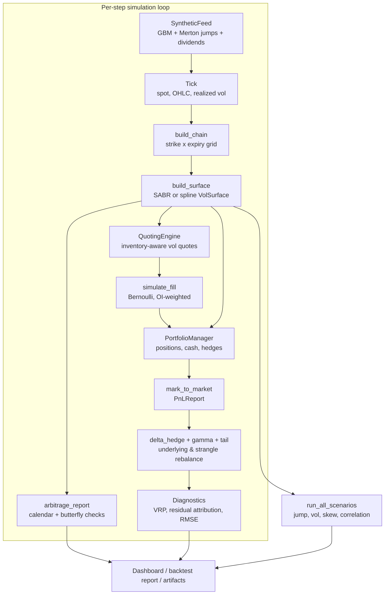
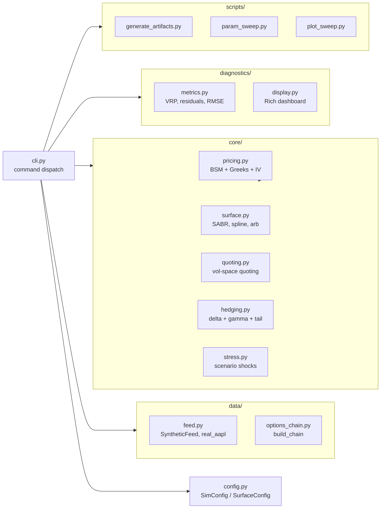
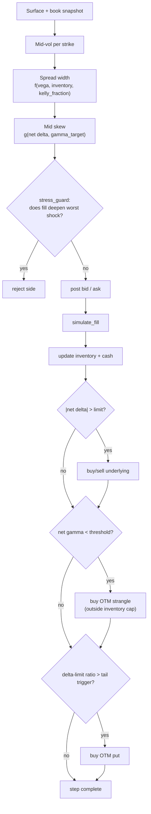

# vol-surface-mm

[](LICENSE)
[](https://www.python.org)
[](pyproject.toml)
[](tests)
[](#limitations)

A deterministic options market-making sandbox. `vol-surface-mm` couples a
synthetic GBM + Merton-jump underlying with a continuously refitted implied
volatility surface (SABR or cubic spline), a two-sided quoting engine over a
full strike–expiry chain, a delta hedger with gamma-protection wing buying,
and a scenario stress runner. Every step is reproducible from a seed, and
every fill, hedge, and Greek exposure is recoverable after the fact.

The repository is intended for people who want to reason about *why* a
quoting or hedging rule produced the P&L it did on a given tick — not for
people who want a turnkey live trading system.

<p align="center">
  
</p>

---

## Table of Contents

- [What This Is](#what-this-is)
- [Highlights](#highlights)
- [System Overview](#system-overview)
- [Quick Start](#quick-start)
- [CLI Reference](#cli-reference)
- [Key Algorithms](#key-algorithms)
- [Outputs and Diagnostics](#outputs-and-diagnostics)
- [Parameter Sweeps](#parameter-sweeps)
- [Repository Layout](#repository-layout)
- [Validation](#validation)
- [Limitations](#limitations)
- [References](#references)
- [License](#license)

---

## What This Is

`vol-surface-mm` is a self-contained, calibration-free research loop for
options market making. It exists to make the following questions
answerable on a single laptop, without any market-data subscription:

- How does a SABR-fitted surface degrade after a jump, and does the
  spline backend recover better?
- Does an inventory-aware quoting rule actually keep the book near
  flat under realistic fill probabilities?
- When the delta hedger leaves the book short gamma, how much of the
  resulting P&L is captured by the second-order Taylor decomposition,
  and how much falls into the residual bucket?
- Does a parameter tuple that looks profitable on GBM survive on
  Bates, rough-vol, and a real AAPL price path?

The honest headline finding (see [results/README.md](results/README.md))
is that **no parameter tuple was profitable on every feed** in the
grouped cross-feed sweep. The repository is published as research
scaffolding for those questions, not as a deployable edge.

---

## Highlights

- **End-to-end loop.** Synthetic feed, surface fit, quoting, fills, delta
  hedging, gamma-protection wing buying, tail hedge, scenario stress, and a
  Rich live dashboard — all in one deterministic step function.
- **Two interchangeable surface backends.** SABR slice calibration and
  spline total-variance fitting expose the same `VolSurface` API, with
  calendar- and butterfly-arbitrage checks after every fit.
- **Stress-aware quoting.** A cached worst-shock revaluation rejects fills
  that would deepen the existing tail loss
  ([src/vol_surface_mm/core/quoting.py](src/vol_surface_mm/core/quoting.py)).
- **Gamma-protection wing buying.** When net gamma falls below a configurable
  threshold the hedger buys an OTM strangle, booked outside inventory limits
  ([src/vol_surface_mm/core/hedging.py](src/vol_surface_mm/core/hedging.py)).
- **Grouped cross-feed sweep.**
  [src/vol_surface_mm/scripts/param_sweep.py](src/vol_surface_mm/scripts/param_sweep.py)
  ranks `(kelly, gamma_target, tail, stress_guard)` tuples by how many of
  `gbm`, `bates`, `rough`, and `real_aapl` survive a live-path rule, then by
  worst-feed P&L.
- **28 pytest cases** covering surface fitting, quoting plumbing, the P&L
  identity, hedging behavior, and the stress-guard reject path.
- **Derivations on paper.** [METHODOLOGY.md](METHODOLOGY.md) carries the SABR
  expansion, the P&L identity, the inventory penalty, and the sweep ranking.

<p align="center">
  
</p>

---

## System Overview

The simulator has one stateful execution loop and several pure transforms.
State lives in the synthetic feed, the portfolio manager, and the diagnostics
trackers. The chain builder, surface fitter, quoting engine, and stress runner
are rebuilt from the current snapshot on each step.



The same loop powers `run` (rendered each step) and `backtest` (silent,
terminal snapshot only). The book starts flat by default; positions
accumulate organically through probabilistic fills, then are managed by
discrete delta hedges, an OTM tail-hedge trigger, and the gamma-protection
trigger. Setting `SimConfig.seeding_mode = "short_straddle"` reproduces the
legacy seeded short-ATM-straddle for comparison.

### Component layout



---

## Quick Start

```bash
python -m venv .venv && source .venv/bin/activate
pip install -e ".[dev]"

vol-surface-mm config --seeding-mode flat       # inspect effective runtime config
vol-surface-mm run --steps 250 --seed 7         # live Rich dashboard
vol-surface-mm backtest --steps 500 --seed 7    # silent, prints AFL report
vol-surface-mm artifacts                        # regenerate results/final_report.*
vol-surface-mm sweep --kelly-shard 0.05         # one shard (repeat for 0.10, 0.15)
vol-surface-mm sweep --merge-only               # merge shard outputs
vol-surface-mm plot-sweep                       # refresh docs/assets/sweep_summary.png
pytest                                          # 28 tests
```

Python 3.11 or newer. Sweep artifacts are committed under `results/`:
[results/param_sweep_grouped.csv](results/param_sweep_grouped.csv),
[results/final_report.txt](results/final_report.txt),
[results/README.md](results/README.md).

---

## CLI Reference

The top-level CLI covers simulation, artifact generation, sweep runs, and
plot rendering.

```
vol-surface-mm <command> [flags]
```

| Command      | Description                                                |
|--------------|------------------------------------------------------------|
| `run`        | Live simulation with real-time Rich dashboard              |
| `backtest`   | Silent full run; prints AFL-style report; exit 1 if VRP ≤ 0|
| `stress`     | Single-snapshot scenario P&L table, then exit              |
| `surface`    | Fit and display vol surface for one snapshot, then exit    |
| `config`     | Print effective simulation config as JSON                  |
| `artifacts`  | Generate final report JSON/TXT and surface snapshot CSV    |
| `sweep`      | Run grouped sweep or merge existing Kelly shard outputs    |
| `plot-sweep` | Render grouped sweep heatmap PNG from sweep CSV outputs    |

Simulation flags apply to `run`, `backtest`, `stress`, `surface`, and `config`:

| Flag                   | Default  | Description                                       |
|------------------------|----------|---------------------------------------------------|
| `--backend`            | `sabr`   | Vol surface backend: `sabr` or `spline`           |
| `--spot`               | `100.0`  | Initial spot price                                |
| `--vol`                | `0.20`   | Initial vol (annual, decimal)                     |
| `--rate`               | `0.04`   | Risk-free rate (continuously compounded)          |
| `--div`                | `0.0`    | Continuous dividend yield                         |
| `--seed`               | `42`     | Seed for price feed and fill simulator            |
| `--steps`              | `250`    | Number of simulation steps                        |
| `--dt`                 | `1/252`  | Step length in years (one trading day)            |
| `--hedge-freq`         | `5`      | Rehedge every N steps                             |
| `--gamma-target`       | `0.005`  | Target net gamma used by the quoting engine       |
| `--kelly-fraction`     | `0.05`   | Kelly risk budget cap for option inventory        |
| `--tail-hedge-trigger` | `0.20`   | Delta-limit ratio that triggers protective puts   |
| `--seeding-mode`       | `flat`   | Initial portfolio seed: `flat` or `short_straddle`|
| `--verbose`            | off      | Print per-step Greeks and fill details            |

---

## Key Algorithms

### SABR implied volatility (Hagan et al., 2002)

Fixed β = 0.5 throughout. For forward F, strike K, expiry T, parameters
(α, ρ, ν):

$$z = \frac{\nu}{\alpha}(FK)^{(1-\beta)/2}\ln\!\frac{F}{K}$$

$$\chi = \ln\!\left(\frac{\sqrt{1-2\rho z+z^2}+z-\rho}{1-\rho}\right)$$

$$\sigma_B(F,K) \approx \frac{\alpha}{(FK)^{(1-\beta)/2}} \cdot \frac{z}{\chi} \cdot \left[1 + \left(\frac{(1-\beta)^2\alpha^2}{24(FK)^{1-\beta}} + \frac{\rho\beta\nu\alpha}{4(FK)^{(1-\beta)/2}} + \frac{(2-3\rho^2)\nu^2}{24}\right)T\right]$$

The ATM (F = K) limit is used when |ln(F/K)| < 1e-7. Parameters are fitted
per expiry by minimising RMSE over the strike grid with `scipy.optimize`.

### Black–Scholes pricing and Greeks

Standard closed-form with d₁, d₂. Seven Greeks computed analytically:
delta, gamma, vega (∂C/∂σ), theta (per calendar day, ÷365), rho, vanna
(∂²C/∂S∂σ), volga (∂²C/∂σ²). Implied vol is inverted by Brent bracket then
Newton refinement; round-trip error is < 1e-8 on representative inputs.

### P&L decomposition

At each step, the portfolio P&L is split by a second-order Taylor expansion:

$$\Delta\text{PnL} = \delta\,\Delta S + \tfrac{1}{2}\gamma\,\Delta S^2 + \theta\,\Delta t + \nu\,\Delta\sigma + \varepsilon$$

where ε absorbs cross-gamma, higher-order vanna/volga, and jump terms not
captured by the first-order Greeks. The identity

```
total_pnl ≡ delta_pnl + gamma_pnl + theta_pnl + vega_pnl + residual_pnl
```

holds to machine precision (tested at 1e-3 tolerance over 10-step paths).

### Quoting and hedging control flow



### Arbitrage checks

Two checks run after every surface fit:

- **Calendar spread.** Total variance TV(K, T) = σ²(K,T)·T must be
  non-decreasing in T at each strike. Violation implies negative forward
  variance.
- **Butterfly.** Call prices C(K) must be convex in K, i.e.
  ∂²C/∂K² ≥ 0. Violation implies a negative risk-neutral density.

Violations are recorded in the per-step arbitrage report and surfaced in
the dashboard's surface-diagnostics panel.

---

## Outputs and Diagnostics

### Variance risk premium (VRP)

$$\text{VRP} = \sigma^2_{\text{IV}} - \sigma^2_{\text{RV}}$$

Positive VRP means implied variance exceeded realized variance over the
tracking window — favorable for a short-vol book if pathwise gamma losses
do not dominate. Negative VRP means realized variance outran the surface
and the book was effectively short gamma into a large move. The risk panel
prints the signed dislocation σ²ᴿⱽ − σ²ᴵⱽ = −VRP separately.

### Residual-attribution kurtosis

Excess kurtosis of the per-step `residual_pnl` series produced by
`ResidualAttributionTracker`. Under pure GBM, excess kurtosis should be
near zero; values well above zero flag tail events — typically the Merton
jump component. A high-kurtosis book is not well replicated by BSM delta
hedging.

### Surface RMSE

$$\text{RMSE} = \sqrt{\frac{1}{N}\sum_{i=1}^{N}\!\left(\hat{\sigma}_i - \sigma_i^{\text{mkt}}\right)^2}$$

Measured in vol space at each step against the chain mid-market IVs used
to fit the surface. Values below 0.003 (30 bps) indicate a good calibration.
High RMSE after a large jump suggests the SABR parameterisation is being
pushed outside its stable region; the spline backend degrades more
gracefully in those cases.

---

## Parameter Sweeps

The sweep harness runs a parameter grid across multiple feeds and ranks
tuples by cross-feed robustness instead of single-row P&L.

```mermaid
flowchart LR
    Grid["(kelly, gamma_target,<br/>tail, stress_guard) grid"] --> Shard["kelly shard<br/>e.g. 0.05 / 0.10 / 0.15"]
    Shard --> Feeds["per-feed runs:<br/>gbm, bates, rough, real_aapl"]
    Feeds --> Rows["param_sweep_part_k0NN.csv"]
    Rows --> Merge["merge-only step"]
    Merge --> All["param_sweep.csv"]
    All --> Group["group by tuple,<br/>rank by feeds-passing<br/>then worst-feed P&L"]
    Group --> Grouped["param_sweep_grouped.csv"]
    Grouped --> Heatmap["plot-sweep<br/>docs/assets/sweep_summary.png"]
```



Selection is based on the least-fragile parameter bundle across `gbm`,
`bates`, `rough`, and `real_aapl`, not the old single-row `var_capture`
winner. The latest grouped run found no tuple profitable on every feed,
so the current defaults remain in place rather than chasing the
least-negative grouped row. Full numerical results are in
[results/README.md](results/README.md).

---

## Repository Layout

```
vol-surface-mm/
├── METHODOLOGY.md              # SABR, P&L identity, sweep ranking
├── pyproject.toml
├── docs/assets/                # dashboard + sweep PNGs
├── results/                    # committed artifact + sweep outputs
├── src/vol_surface_mm/
│   ├── cli.py                  # top-level command dispatch
│   ├── config.py               # SimConfig, SurfaceConfig
│   ├── core/
│   │   ├── pricing.py          # BSM, Greeks, IV inversion
│   │   ├── surface.py          # SABR + spline + arbitrage checks
│   │   ├── quoting.py          # inventory-aware vol-space quoting
│   │   ├── hedging.py          # delta + gamma-wing + tail hedges
│   │   └── stress.py           # scenario shocks
│   ├── data/
│   │   ├── feed.py             # synthetic feed + real_aapl loader
│   │   └── options_chain.py    # build_chain
│   ├── diagnostics/
│   │   ├── metrics.py          # VRP, residuals, RMSE
│   │   └── display.py          # Rich dashboard
│   └── scripts/
│       ├── generate_artifacts.py
│       ├── param_sweep.py
│       └── plot_sweep.py
└── tests/                      # 28 pytest cases
```

---

## Validation

The pytest suite is scoped to invariants that should hold regardless of
parameter choices:

- **Pricing round-trip.** Implied vol to price to implied vol within 1e-8.
- **Greek identities.** Finite-difference checks for delta, gamma, vega,
  theta against the closed-form values.
- **P&L identity.** `total_pnl - sum(components)` within 1e-3 on
  multi-step paths.
- **Surface arbitrage.** Calendar and butterfly checks fire on
  hand-crafted violating surfaces and stay silent on fitted ones.
- **Stress-guard rejects.** A configured worst-case shock causes the
  quoting engine to drop the offending side rather than fill it.
- **CLI smoke.** `run`, `backtest`, `artifacts`, and `sweep --merge-only`
  exit cleanly on a small step budget.

Run the full suite with `pytest` (28 tests, no network access required
for the default synthetic path).

---

## Limitations

The simulator is deliberately limited; the design is meant to be honest
about what is synthetic.

- **Synthetic execution by default.** GBM + Merton is a reasonable
  first-order process but does not reproduce real vol-of-vol dynamics,
  microstructure, or intraday autocorrelation. The optional `real_aapl`
  sweep feed only replaces the underlying path; option chains, fills,
  and surface fitting remain synthetic.
- **No real order book.** Fills are Bernoulli with OI-weighted probability,
  not crossed against actual quotes.
- **Flat term structure.** Rho is computed but the rate curve is not
  shocked.
- **European exercise only.** No American early-exercise premium.
- **Static vol-of-vol.** SABR ν is calibrated per expiry as a static
  parameter; it does not evolve between steps.
- **Costs do not feed back.** Transaction costs are deducted from P&L but
  do not widen quoted spreads.

Natural extensions the existing factories make straightforward:

- Plug new historical paths into `data/feed.py`; the rest of the stack
  is feed-agnostic.
- Add an SVI or Bergomi backend; `build_surface` dispatches on `backend`.
- Add an American pricer (e.g., Barone–Adesi–Whaley) behind a `pricer`
  flag in `ChainConfig`.
- Wire `ResidualAttributionTracker` output into an online
  Avellaneda–Stoikov style inventory controller.

---

## References

1. Hagan, P. S., Kumar, D., Lesniewski, A. S., & Woodward, D. E. (2002).
   *Managing smile risk.* Wilmott Magazine, 84–108.
2. Gatheral, J. (2006). *The Volatility Surface: A Practitioner's Guide.*
   Wiley Finance.
3. Black, F., & Scholes, M. (1973). The pricing of options and corporate
   liabilities. *Journal of Political Economy*, 81(3), 637–654.

---

## License

This project is licensed under [CC BY-NC 4.0](LICENSE) — free for
non-commercial research and educational use. Commercial use is not
permitted.
